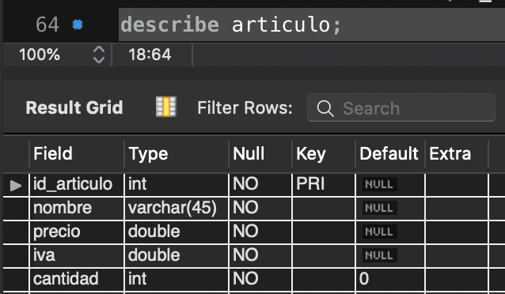
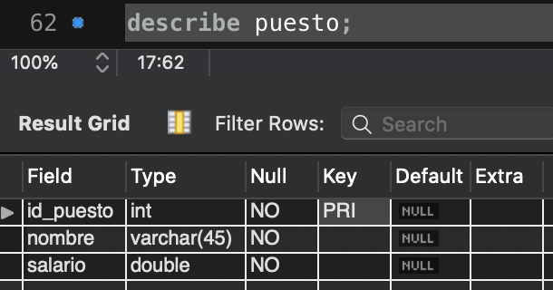
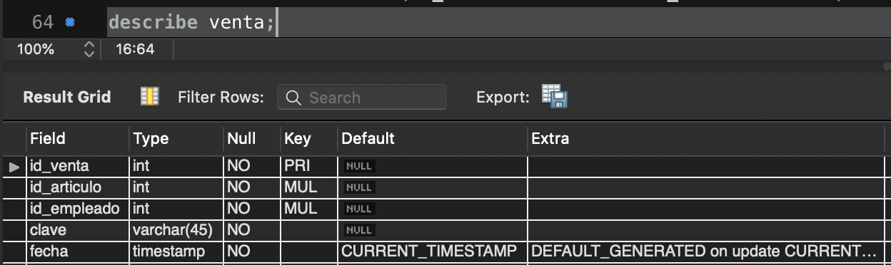
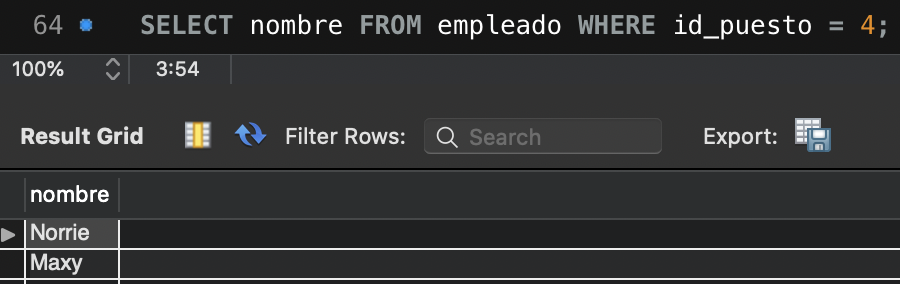
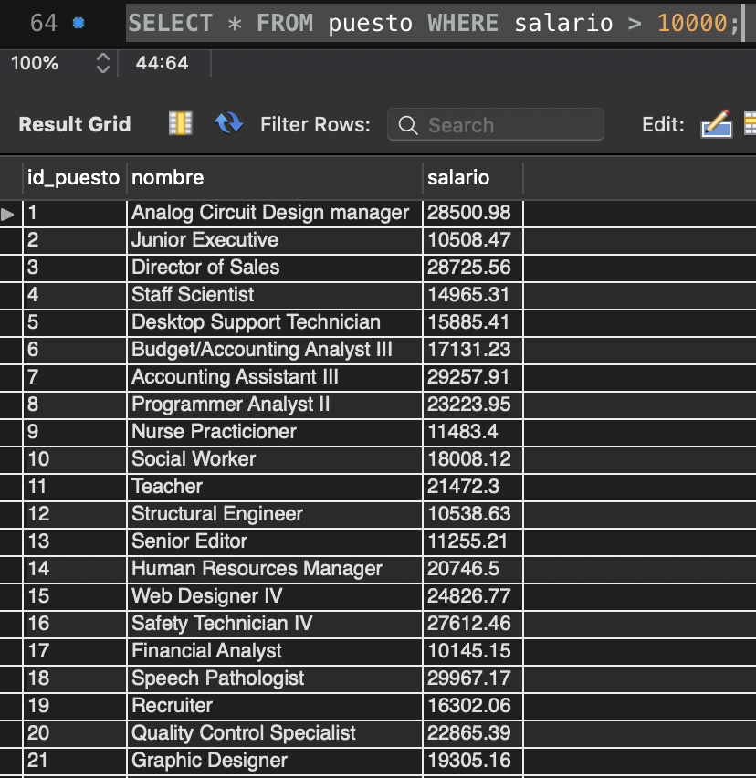
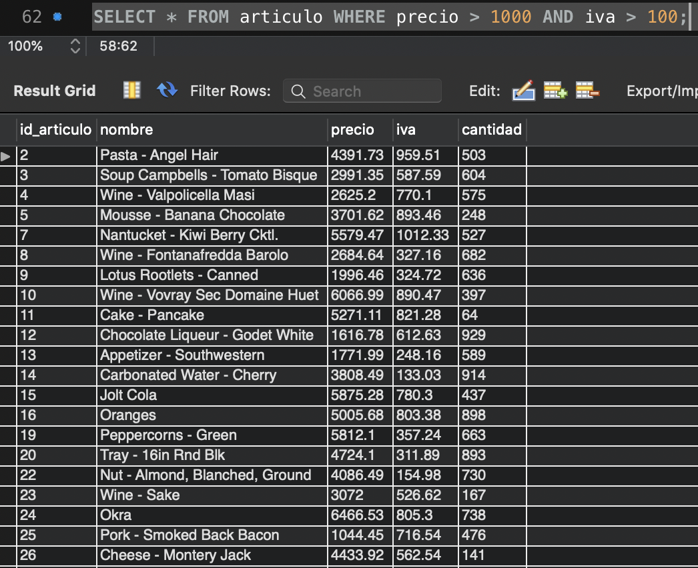
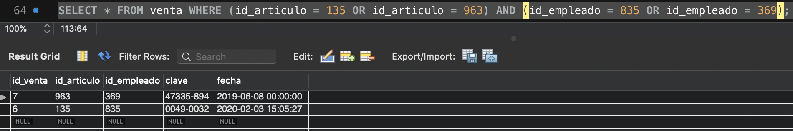
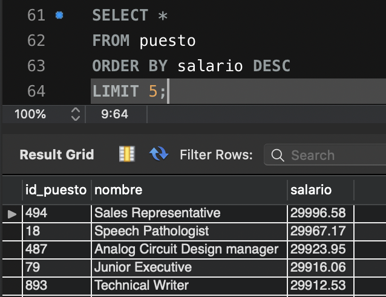

# Solución de Retos - Sesión 1

### Requisitos :clipboard:

1. MySQL Workbench instalado.

## Reto 1: Estructura de una tabla

<div style="text-align: justify;">

### 1. Objetivos :dart:

- Consultar la estructura de algunas tablas.

### 2. Desarrollo :rocket:

Usando la base de datos `tienda`, muestra la descripción de las tablas `articulo`, `puesto` y `venta`. Por cada tipo de dato que encuentras llena la siguiente tabla, a mano. Usa la [Documentación de MySQL](https://dev.mysql.com/doc/refman/8.0/en/data-types.html) como referencia.

```sql
describe articulo;
```

```sql
describe puesto;
```

```sql
describe venta;

```
| Tipo        | Descripción                                        |
|-------------|----------------------------------------------------|
| `ìnt`       | Números Enteros                                    |
| `varchar`   | Cadenas de caracteres de longitud variable         |
| `timestamp` | Fecha y hora                                       |
| `double`    | Números con decimales                              |

## Reto 2: Estructura básica de una consulta

<div style="text-align: justify;">

### 1. Objetivos :dart:

- Escribir consultas que permitan responder a algunas preguntas.

### 2. Desarrollo :rocket:

Usando la base de datos `tienda`, escribe consultas que permitan responder las siguientes preguntas.

- ¿Cuál es el nombre de los empleados con el puesto 4?
```sql
SELECT nombre
FROM empleado
WHERE id_puesto = 4;
```

- ¿Qué puestos tienen un salario mayor a $10,000?
```sql
SELECT *
FROM puesto
WHERE salario > 10000;
```

- ¿Qué articulos tienen un precio mayor a $1,000 y un iva mayor a 100?
```sql
SELECT *
FROM articulo
WHERE precio > 1000 AND iva > 100;
```

- ¿Qué ventas incluyen los artículo 135 o 963 y fueron hechas por los empleados 835 o 369?
```sql
SELECT *
FROM ventadescribe_puesto
WHERE (id_articulo = 135 OR id_articulo = 963)
  AND (id_empleado = 835 OR id_empleado = 369);
```


## Reto 3: Ordenamientos y Límites

<div style="text-align: justify;">

### 1. Objetivos :dart:

- Escribir consultas que permitan responder a algunas preguntas mediante ordenamientos y límites.

### 2. Desarrollo :rocket:

Usando la base de datos `tienda`, escribe una consulta que permita obtener el top 5 de puestos por salarios.

```sql
SELECT *
FROM puesto
ORDER BY salario DESC
LIMIT 5;
```

