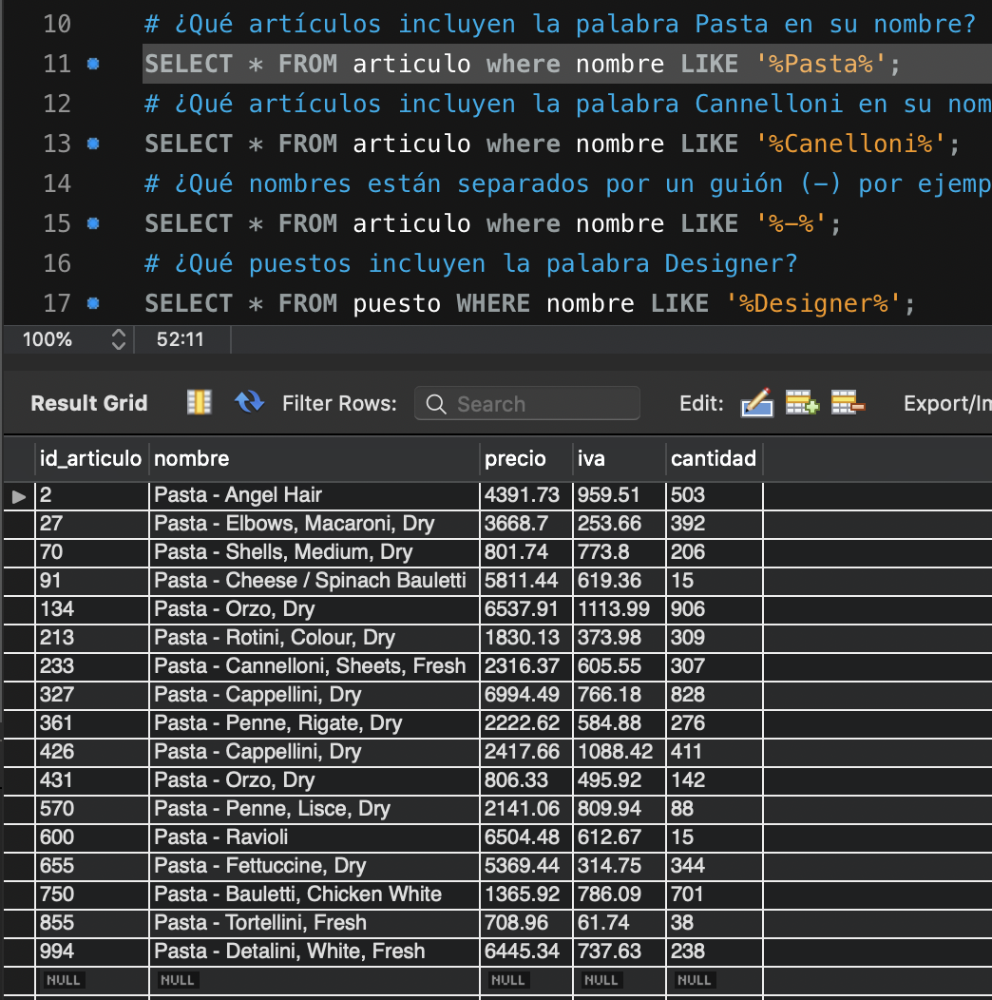

# Solución de Retos - Sesión 2

### Requisitos :clipboard:

1. MySQL Workbench instalado.

## Reto 1: Búsqueda de patrones mediante LIKE

<div style="text-align: justify;">

### 1. Objetivos :dart:

- Escribir consultas que permitan responder a algunas preguntas.

### 2. Desarrollo :rocket:

Usando la base de datos `tienda`, escribe consultas que permitan responder las siguientes preguntas.

- ¿Qué artículos incluyen la palabra `Pasta` en su nombre?
```sql
SELECT * FROM articulo where nombre LIKE '%Pasta%';
```

- ¿Qué artículos incluyen la palabra `Cannelloni` en su nombre?
```sql
SELECT * FROM articulo where nombre LIKE '%Canelloni%';
```

- ¿Qué nombres están separados por un guión (`-`) por ejemplo `Puree - Kiwi`?
```sql
SELECT * FROM articulo where nombre LIKE '%-%';
```

- ¿Qué puestos incluyen la palabra `Designer`?
```sql
SELECT * FROM puesto WHERE nombre LIKE '%Designer%';
```

- ¿Qué puestos incluyen la palabra `Developer`?
```sql
SELECT * FROM puesto WHERE nombre LIKE '%Developer%';
```


## Reto 2: Funciones de agrupamiento

<div style="text-align: justify;">

### 1. Objetivos :dart:

- Escribir consultas que permitan responder a algunas preguntas.

### 2. Desarrollo :rocket:

Usando la base de datos `tienda`, escribe consultas que permitan responder las siguientes preguntas.

- ¿Cuál es el promedio de salario de los puestos?
```sql
SELECT ROUND(AVG(salario), 2) AS "Salario Promedio" FROM puesto;
```

- ¿Cuántos artículos incluyen la palabra `Pasta` en su nombre?
```sql
SELECT COUNT(*) AS "Pasta" FROM articulo WHERE nombre LIKE "%Pasta%";
```

- ¿Cuál es el salario mínimo y máximo?
```sql
SELECT MIN(salario) AS 'Salario Minimo', MAX(salario) AS 'Salario Maximo' FROM puesto;
```

- ¿Cuál es la suma del salario de los últimos cinco puestos agregados?
```sql
SELECT SUM(salario) AS 'Suma ultimos 5 salarios' FROM puesto WHERE id_puesto > 995;
```


## Reto 3: Agrupamientos

<div style="text-align: justify;">

### 1. Objetivos :dart:

- Escribir consultas que permitan responder a algunas preguntas.

### 3. Desarrollo :rocket:

Usando la base de datos `tienda`, escribe consultas que permitan responder las siguientes preguntas.

- ¿Cuántos registros hay por cada uno de los puestos?
```sql
SELECT nombre, COUNT(*) AS 'Total' FROM puesto GROUP BY nombre;
```

- ¿Cuánto dinero se paga en total por puesto?
```sql
SELECT nombre, SUM(salario) AS 'Total Sueldos' FROM puesto GROUP BY nombre;
```

- ¿Cuál es el número total de ventas por vendedor?
```sql
SELECT id_empleado, COUNT(*) AS 'Ventas' FROM venta GROUP BY id_empleado;
```

- ¿Cuál es el número total de ventas por artículo?
```sql
SELECT id_articulo, COUNT(*) AS 'Ventas' FROM venta GROUP BY id_articulo;
```
