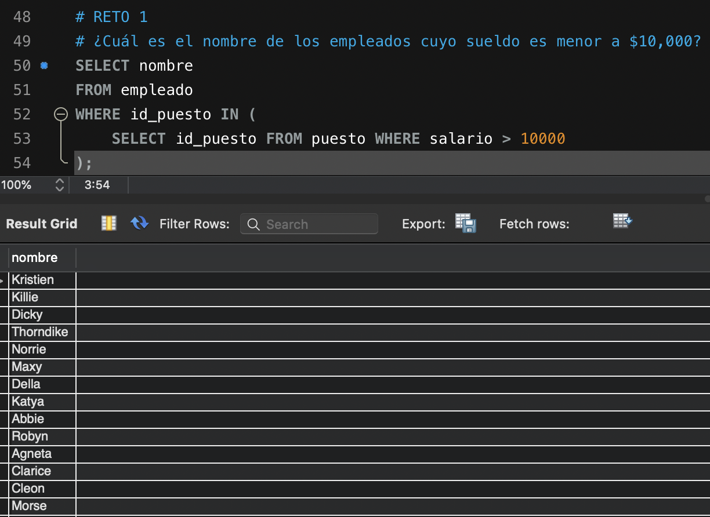
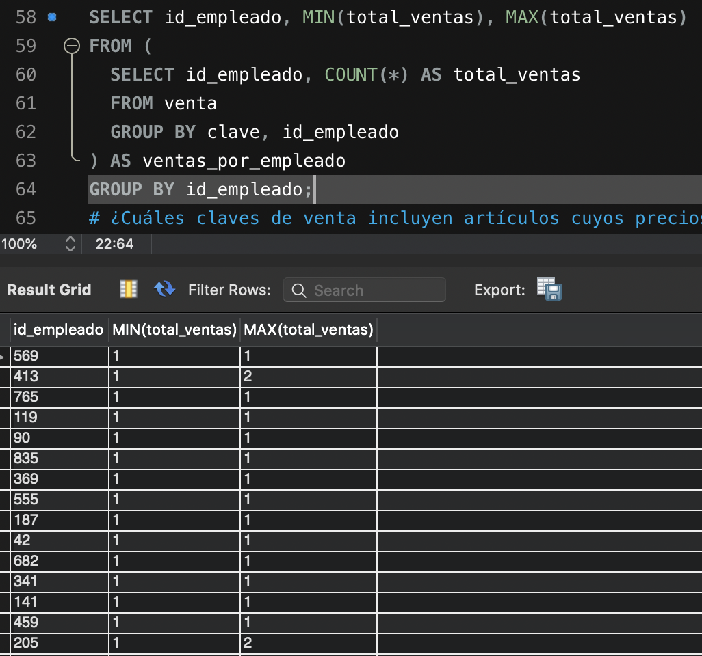
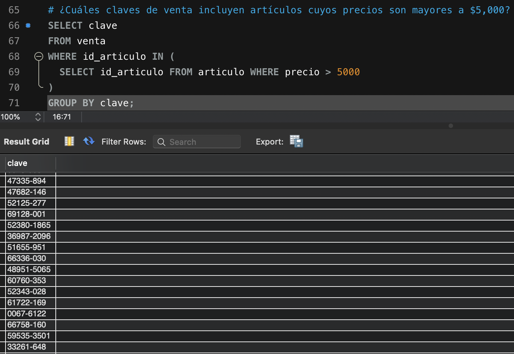
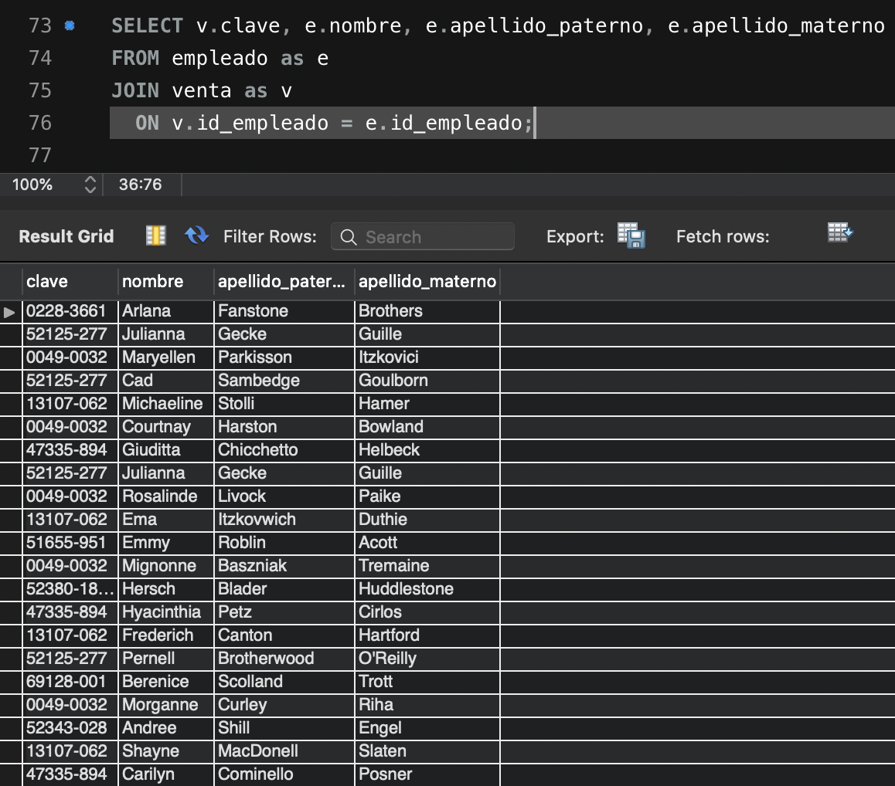
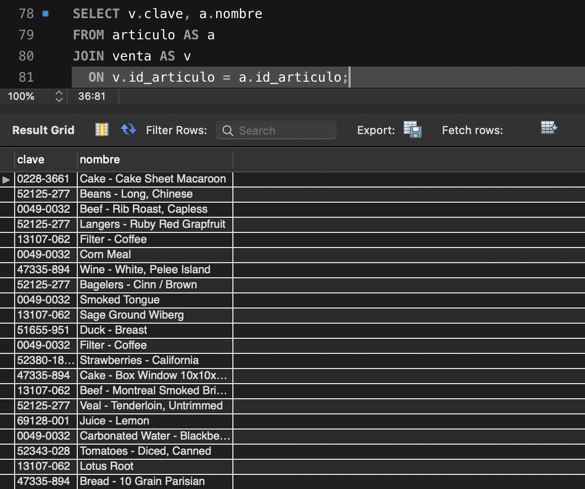
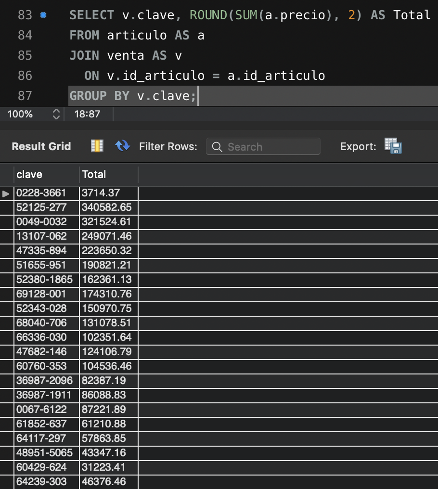
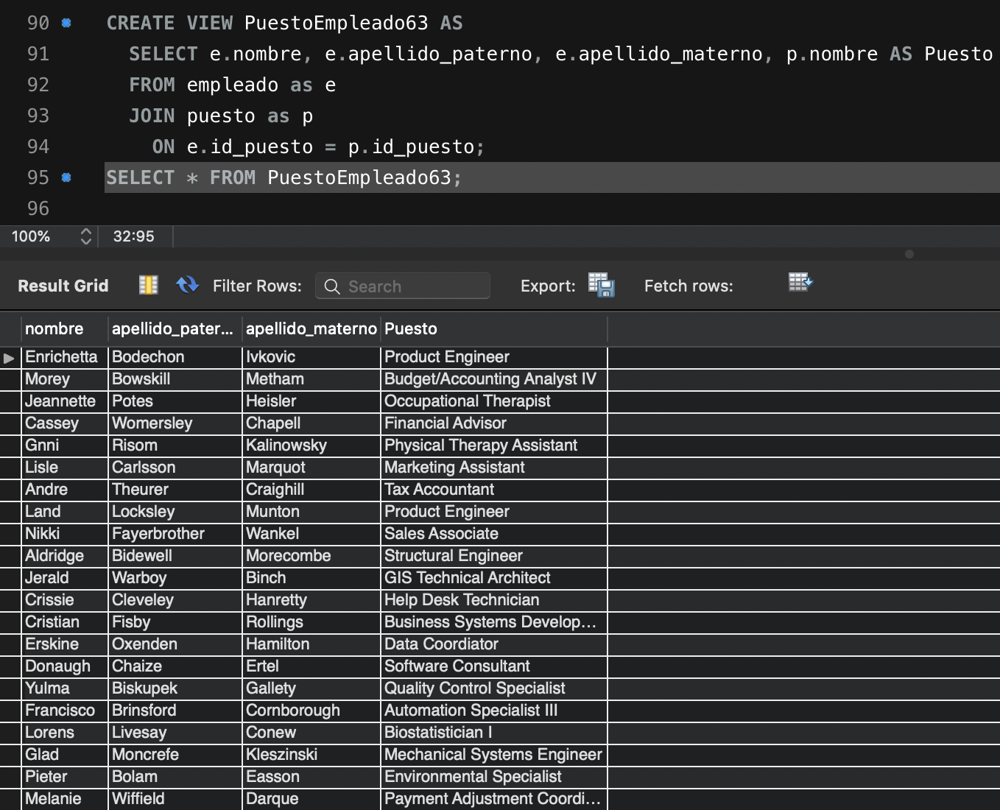
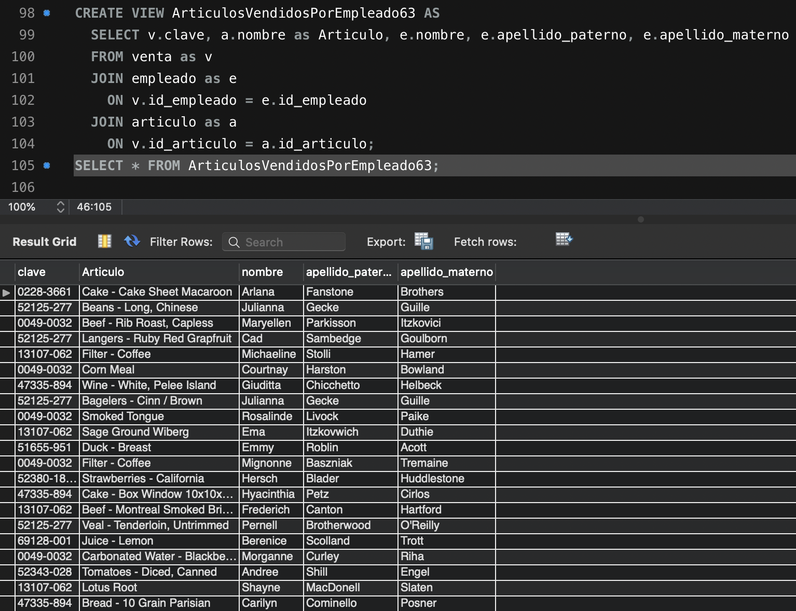

# Solución de Retos - Sesión 3

### Requisitos :clipboard:

1. MySQL Workbench instalado.


## Reto 1: Subconsultas

<div style="text-align: justify;">

### 1. Objetivos :dart:

- Escribir consultas que permitan responder a algunas preguntas.

### 2. Desarrollo :rocket:

Usando la base de datos `tienda`, escribe consultas que permitan responder las siguientes preguntas.

- ¿Cuál es el nombre de los empleados cuyo sueldo es mayor a \$100,000?
```sql
SELECT nombre
FROM empleado
WHERE id_puesto IN (
	SELECT id_puesto FROM puesto WHERE salario > 10000
);
```

- ¿Cuál es la cantidad mínima y máxima de ventas de cada empleado?
```sql
SELECT id_empleado, MIN(total_ventas), MAX(total_ventas)
FROM (
  SELECT id_empleado, COUNT(*) AS total_ventas
  FROM venta
  GROUP BY clave, id_empleado
) AS ventas_por_empleado
GROUP BY id_empleado;
```

- ¿Cuáles claves de venta incluyen artículos cuyos precios son mayores a \$5,000?
```sql
SELECT clave
FROM venta
WHERE id_articulo IN (
  SELECT id_articulo FROM articulo WHERE precio > 5000
)
GROUP BY clave;
```



## Reto 2: Joins

<div style="text-align: justify;">

### 1. Objetivos :dart:

- Escribir consultas que permitan responder a algunas preguntas.

### 2. Desarrollo :rocket:

Usando la base de datos `tienda`, escribe consultas que permitan responder las siguientes preguntas.

- ¿Cuál es el nombre de los empleados que realizaron cada venta?
```sql
SELECT v.clave, e.nombre, e.apellido_paterno, e.apellido_materno
FROM empleado as e
JOIN venta as v
  ON v.id_empleado = e.id_empleado;
```

- ¿Cuál es el nombre de los artículos que se han vendido?
```sql
SELECT v.clave, a.nombre
FROM articulo AS a
JOIN venta AS v
  ON v.id_articulo = a.id_articulo;
```

- ¿Cuál es el total de cada venta?
```sql
SELECT v.clave, ROUND(SUM(a.precio), 2) AS Total
FROM articulo AS a
JOIN venta AS v
  ON v.id_articulo = a.id_articulo
GROUP BY v.clave;
```


## Reto 3: Definición de vistas

<div style="text-align: justify;">

### 1. Objetivos :dart:

- Definir vistas sobre algunas consultas.

### 2. Desarrollo :rocket:

Usando la base de datos `tienda`, define las siguientes vistas que permitan obtener la siguiente información.

- Obtener el puesto de un empleado.
```sql
CREATE VIEW PuestoEmpleado63 AS
  SELECT e.nombre, e.apellido_paterno, e.apellido_materno, p.nombre AS Puesto
  FROM empleado as e
  JOIN puesto as p
    ON e.id_puesto = p.id_puesto;
```

- Saber qué artículos ha vendido cada empleado
```sql
CREATE VIEW ArticulosVendidosPorEmpleado63 AS
  SELECT v.clave, a.nombre as Articulo, e.nombre, e.apellido_paterno, e.apellido_materno
  FROM venta as v
  JOIN empleado as e
    ON v.id_empleado = e.id_empleado
  JOIN articulo as a
    ON v.id_articulo = a.id_articulo;
```
