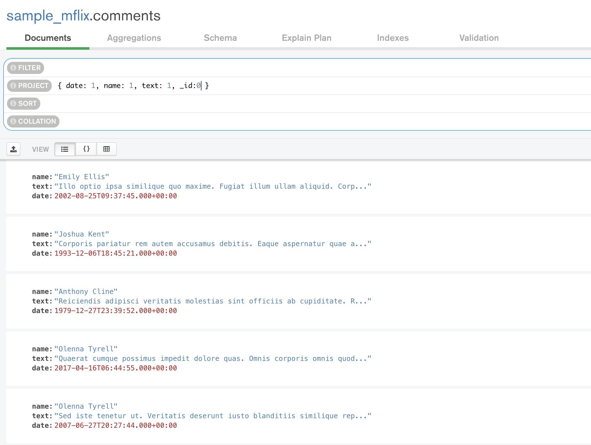
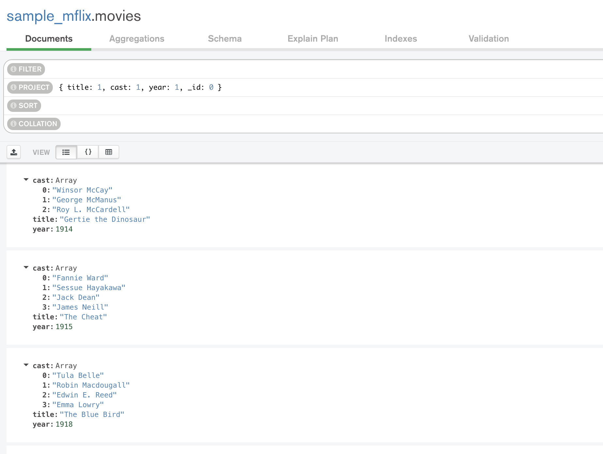
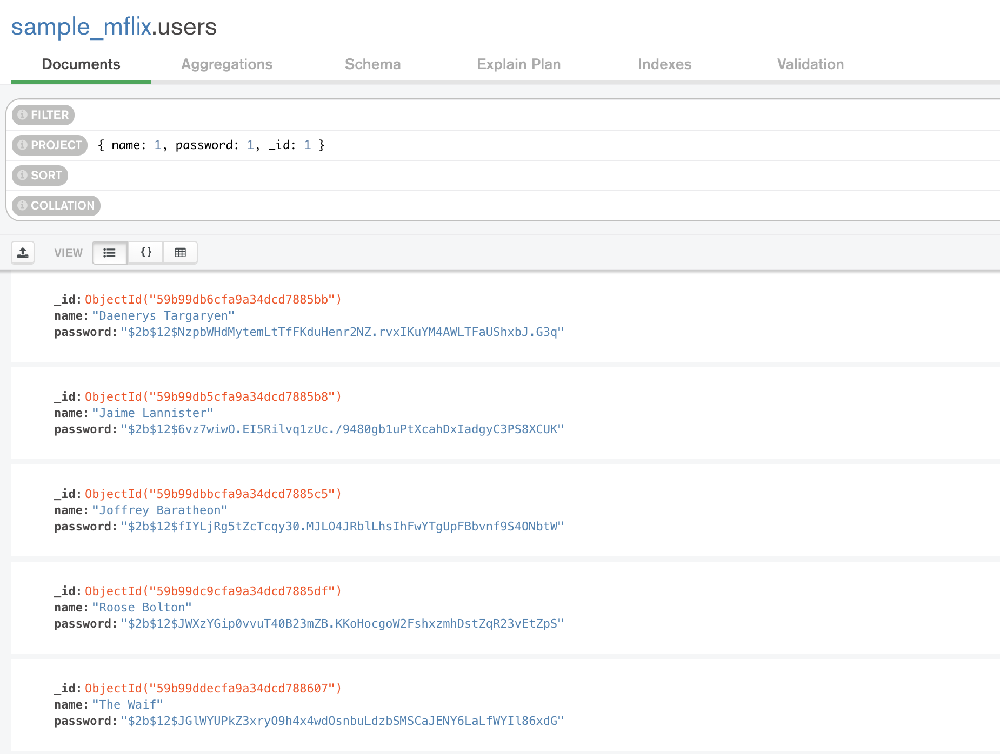
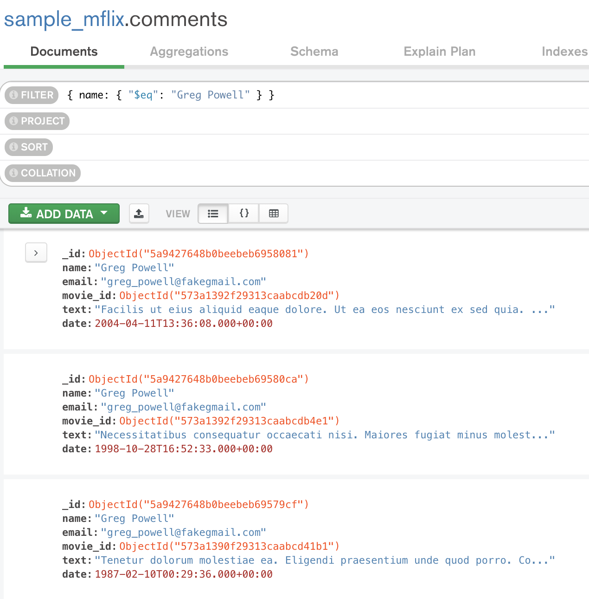
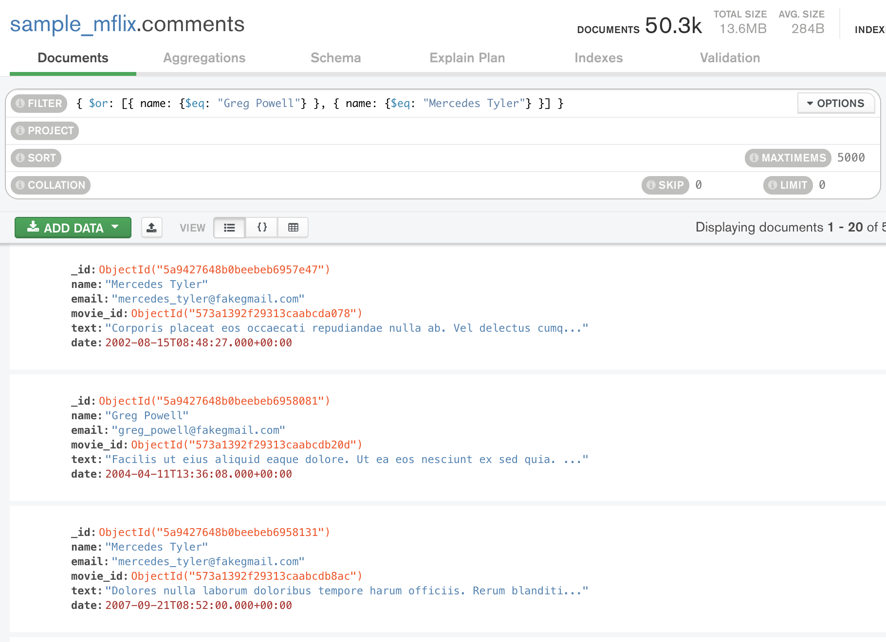
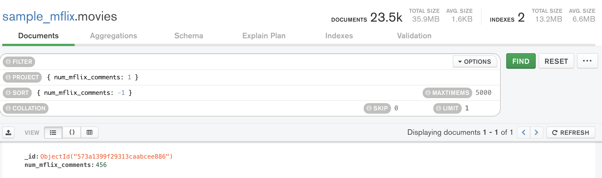
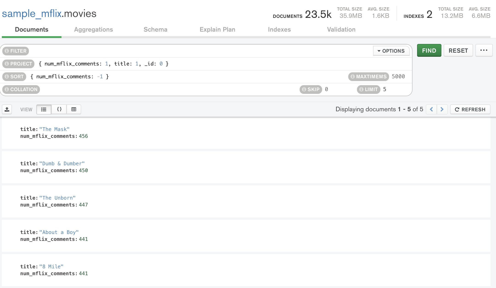

# Solución de Retos - Sesión 4

### Requisitos :clipboard:

1. MongoDB Compass instalado.

## Reto 1: Colecciones, Documentos y Proyecciones

<div style="text-align: justify;">

### 1. Objetivos :dart:

- Proyectar columnas sobre distintos documentos para repasar algunos conceptos.

### 2. Desarrollo :rocket:

Usando la base de datos `sample_mflix`, proyecta los datos que se solicitan.

- Fecha, nombre y texto de cada comentario.
```json
{
  "project": {
    "date": 1,
    "name": 1,
    "text": 1,
    "_id": 0
  }
}
```

- Título, elenco y año de cada película.
```json
{
  "project": {
    "title": 1,
    "cast": 1,
    "year": 1,
    "_id": 0
  }
}
```

- Nombre y contraseña de cada usuario.
```json
{
  "project": {
    "name": 1,
    "password": 1,
    "_id": 0
  }
}
```



## Reto 2: Filtros básicos

<div style="text-align: justify;">

### 1. Objetivos :dart:

- Proyectar columnas sobre distintos documentos para repasar algunos conceptos.

### 2. Desarrollo :rocket:

Usando la base de datos `sample_mflix`, agrega proyeccciones, filtros, ordenamientos y límites que permitan contestar las siguientes preguntas.

- ¿Qué comentarios ha hecho Greg Powell?
```json
{
  "filter": {
    "name": {
      "$eq": "Greg Powell"
    }
  }
}
```

- ¿Qué comentarios han hecho Greg Powell o Mercedes Tyler?
```json
{
  "filter": {
    "$or": [
      {
        "name": {
          "$eq": "Greg Powell"
        }
      },
      {
        "name": {
          "$eq": "Mercedes Tyler"
        }
      }
    ]
  }
}
```

- ¿Cuál es el máximo número de comentarios en una película?
```json
{
  "project": {
    "num_mflix_comments": 1
  },
  "sort": {
    "num_mflix_comments": -1
  },
  "limit": 1
}
```

- ¿Cuál es el título de las cinco películas más comentadas?
```json
{
  "project": {
    "num_mflix_comments": 1,
    "title": 1,
    "_id": 0
  },
  "sort": {
    "num_mflix_comments": -1
  },
  "limit": 5
}
```
