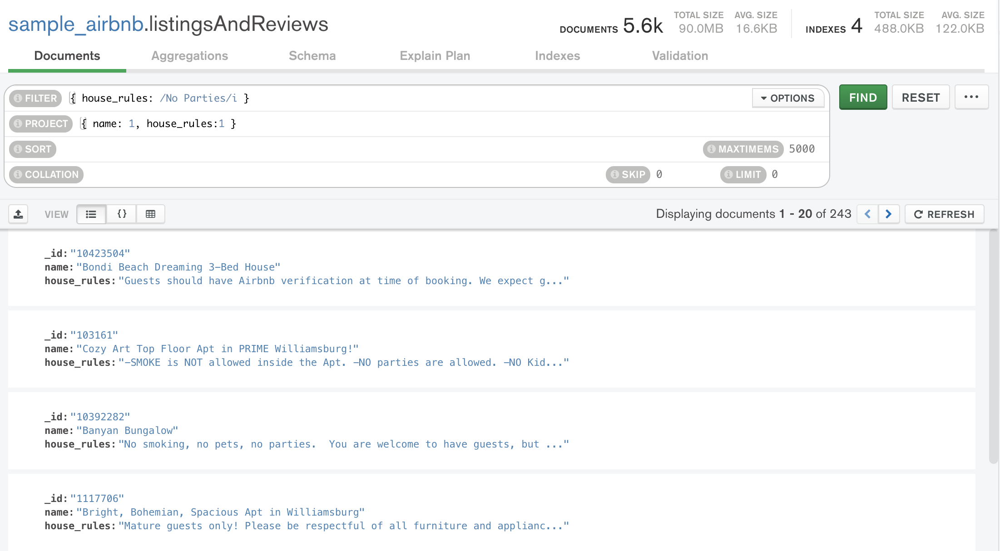
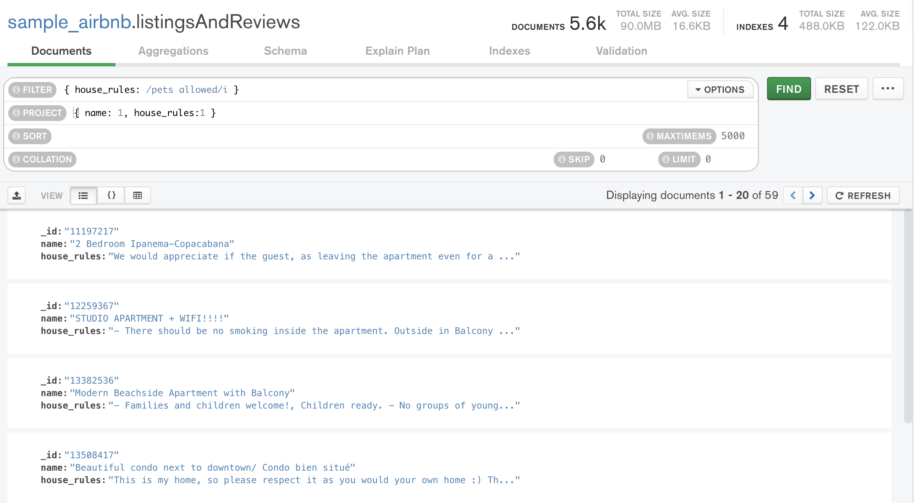
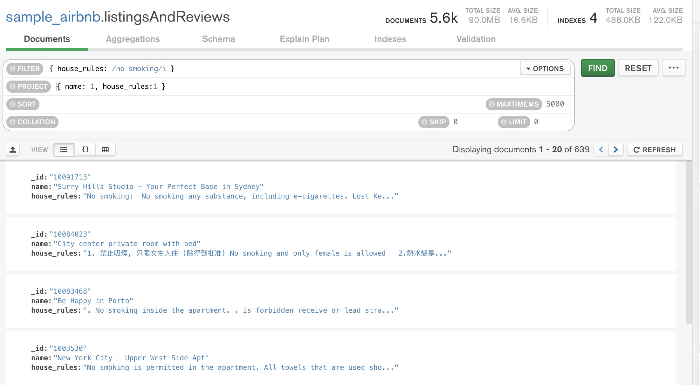
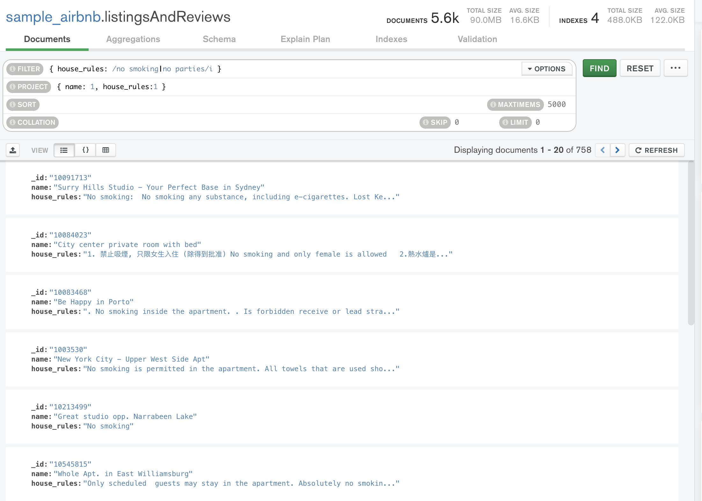
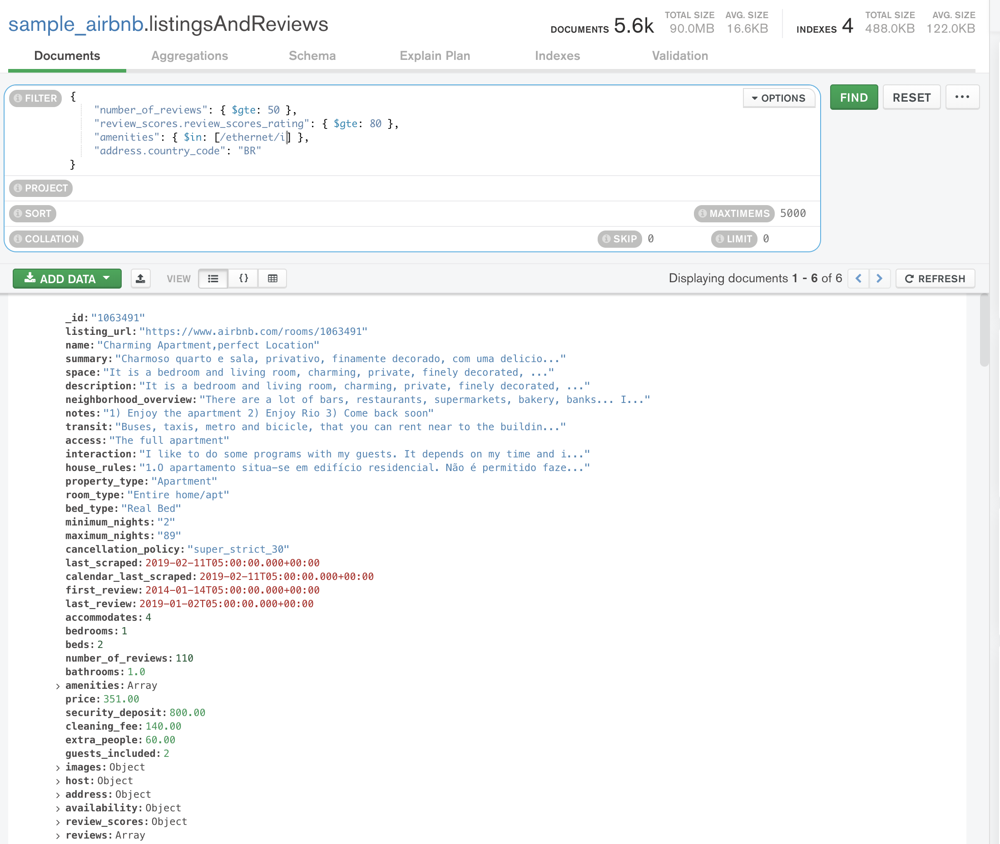
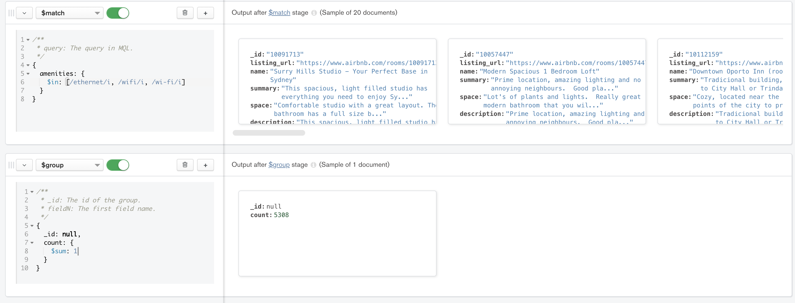

# Solución de Retos - Sesión 5

### Requisitos :clipboard:

1. MongoDB Compass instalado.


## Reto 1: Expresiones regulares

<div style="text-align: justify;">

### 1. Objetivos :dart: 

- Poner en práctica el uso de expresiones regulares.

### 2. Desarrollo :rocket:

Usando la base de datos `sample_airbnblistingsAndReviews`, realiza los siguientes filtros:

- Propiedades que no permitan fiestas.
```json
{
  filter: {
    house_rules: RegExp('No Parties', i)
  },
  project: {
    name: 1,
    house_rules: 1
  }
}
```

- Propiedades que admitan mascotas.
```json
{
  filter: {
    house_rules: RegExp('pets allowed', i)
  },
  project: {
    name: 1,
    house_rules: 1
  }
}
```

- Propiedades que no permitan fumadores.
```json
{
  filter: {
    house_rules: RegExp('no smoking', i)
  },
  project: {
    name: 1,
    house_rules: 1
  }
}
```

- Propiedades que no permitan fiestas ni fumadores.
```json
{
  filter: {
    house_rules: RegExp('no smoking|no parties', i)
  },
  project: {
    name: 1,
    house_rules: 1
  }
}
```



## Reto 2: Notación punto y arreglos

<div style="text-align: justify;">

### 1. Objetivos :dart: 

- Proyectar columnas sobre distintos documentos para repasar algunos conceptos.

### 2. Desarrollo :rocket:

Usando la colección `sample_airbnb.listingsAndReviews`, agrega un filtro que permita obtener todas las publicaciones que tengan 50 o más comentarios, que la valoración sea mayor o igual a 80, que cuenten con conexión a Internet vía cable y estén ubicada en Brazil.
```json
{
  "filter": {
    "number_of_reviews": { $gte: 50 },
    "review_scores.review_scores_rating": { $gte: 80 },
    "amenities": { $in: [/ethernet/i] },
    "address.country_code": "BR"
  }
}
```


## Reto 3: Introducción a las agregaciones

<div style="text-align: justify;">

### 1. Objetivos :dart: 

- Proyectar columnas sobre distintos documentos para repasar algunos conceptos.

### 2. Desarrollo :rocket:

Usando la colección `sample_airbnb.listingsAndReviews`, mediante el uso de agregaciones, encontrar el número de publicaciones que tienen conexión a Internet, sea desde Wifi o desde cable (Ethernet).
```json
[{$match: {
  amenities: {
    $in: [/ethernet/i, /wifi/i, /wi-fi/i]
  }
}}, {$group: {
  _id: null,
  count: {
    $sum: 1
  }
}}]
```
