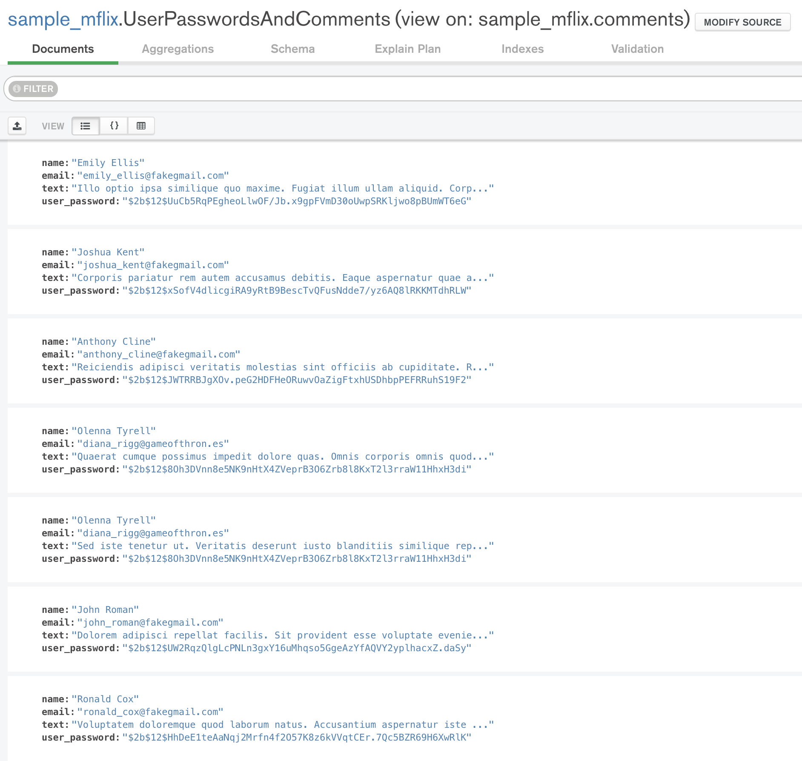

# Solución de Retos - Sesión 6

### Requisitos :clipboard:

1. MongoDB Compass instalado.

## Reto 1: Agrupamientos

<div style="text-align: justify;">

### 1. Objetivos :dart: 

- Poner en práctica el uso de agrupamientos.

### 2. Desarrollo :rocket:

Con base en el ejemplo 1, modifica el agrupamiento para que muestre el costo promedio por habitación por país de las propiedades de tipo casa.

```json
[{$match: {
  property_type: "House",
  bedrooms: { $gte: 1 }
}}, {$addFields: {
  costo_recamara: { 
    $divide: ["$price", "$bedrooms"]
  }
}}, {$group: {
  _id: "$address.country",
  recamaras: {
    $sum: 1
  },
  total: {
    $sum: "$costo_recamara"
  }
}}, {$addFields: {
  costo_promedio: {
    $divide: ["$total", "$recamaras"]
  }
}}]
```


## Reto 2: Asociación de colecciones

<div style="text-align: justify;">

### 1. Objetivos :dart: 

- Proyectar columnas sobre distintos documentos para repasar algunos conceptos.

### 2. Desarrollo :rocket:

Usando las colecciones `comments` y `users`, se requiere conocer el correo y contraseña de cada persona que realizó un comentario. Construye un pipeline que genere como resultado estos datos.
```json
[{$lookup: {
  from: 'users',
  localField: 'name',
  foreignField: 'name',
  as: 'user'
}}, {$addFields: {
  user_object: { $arrayElemAt: ["$user", 0] }
}}, {$addFields: {
  user_password: "$user_object.password"
}}, {$project: {
  _id: 0,
  name: 1,
  email: 1,
  user_password: 1,
  text: 1
}}]
```


## Reto 3: Generación de vistas

<div style="text-align: justify;">

### 1. Objetivos :dart: 

- Proyectar columnas sobre distintos documentos para repasar algunos conceptos.

### 2. Desarrollo :rocket:

1. Usando el *pipeline* que generaste en el Reto 2, genera la vista correspondiente.
