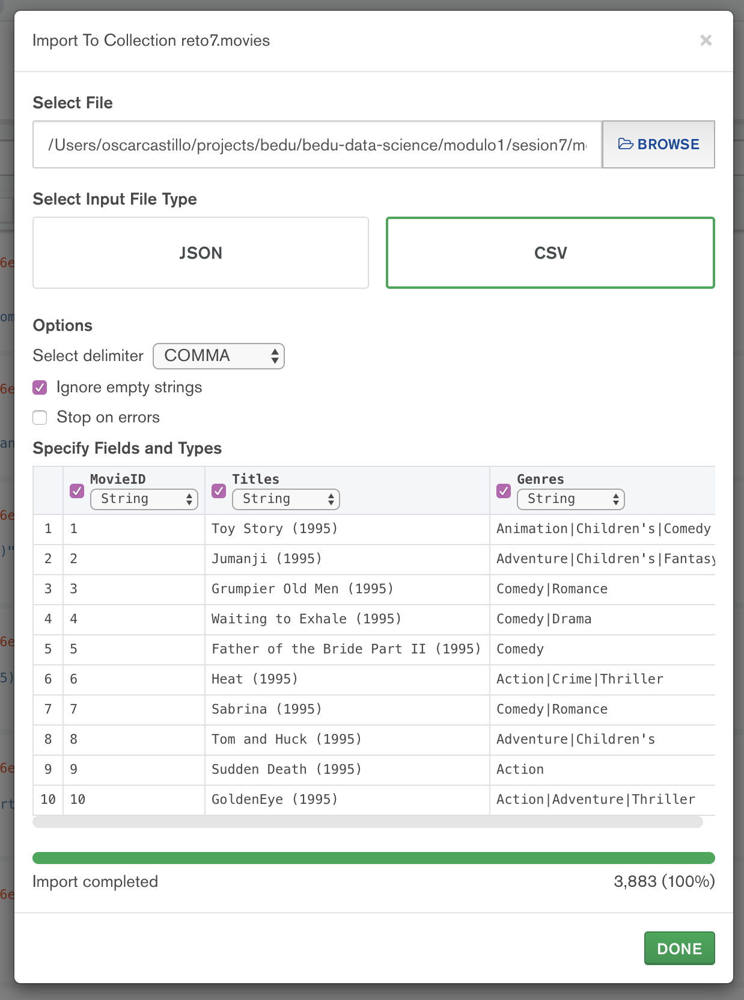

# Solución de Retos - Sesión 7

### Requisitos :clipboard:
- Servidor __MySQL__ instalado


## Reto 1: Realizando operaciones con tablas

### 1. Objetivos :dart:
- Realizar operaciones SQL para administrar tablas
- Crear tablas acorde a los datos

### 2. Desarrollo :rocket:

1. Definir los campos y tipos de datos para la tabla `movies` haciendo uso de los archivos `movies.dat` y `README`.
```
| Columna |  Tipo   |
|---------|---------|
| MovieID | INTEGER |
| Title   | VARCHAR |
| Genres  | VARCHAR |
```
2. Crear la tabla `movies` (recuerda usar el mismo nombre del archivo sin la extensión para vincular nombres de tablas con archivos).
```sql
CREATE TABLE movies(
  MovieID INTEGER PRIMARY KEY,
  Title VARCHAR(80),
  Genres VARCHAR(100)
);
```

3. Definir los campos y tipos de datos para la tabla `ratings` haciendo uso de los archivos `ratings.dat` y `README`.
```
| Columna   |  Tipo    |
|-----------|----------|
| UserID    | INTEGER  |
| MovieID   | INTEGER  |
| Rating    | TINYINT  |
| Timestamp | BIGINT   |
```
4. Crear la tabla ratings (recuerda usar el mismo nombre del archivo sin la extensión para vincular nombres de tablas con archivos)
```sql
CREATE TABLE ratings(
  UserID INTEGER,
  MovieID INTEGER,
  Rating  TINYINT,
  Timestamp BIGINT,
  FOREIGN KEY (UserID) REFERENCES users(UserId) ON DELETE CASCADE ON UPDATE CASCADE,
  FOREIGN KEY (MovieID) REFERENCES movies(MovieID) ON DELETE CASCADE ON UPDATE CASCADE
);
```

## Reto 2: Importando datos a una tabla en formato CSV

### 1. Objetivos :dart:
- Aplicar el procedimiento para importación de datos a una tabla
- Validar que la correcta importación de los datos

### 2. Desarrollo :rocket:

1. Usando como base el archivo `movies.dat`, limpiarlo e importar los datos en la tabla `movies` creada en el Reto 1.

1. Usando como base el archivo `ratings.dat`, limpiarlo e importar los datos en la tabla `ratings` creada en el Reto 2.


## Reto 3: Realizando operaciones con Colecciones e importando datos

### 1. Objetivos :dart:
- Que el alumno cuente con una Colección para importar datos
- Que el alumno importe datos en formato CSV a una Colección

### 2. Desarrollo :rocket:

1. Importando movies en Mongo:


2. Importando ratings en Mongo:
